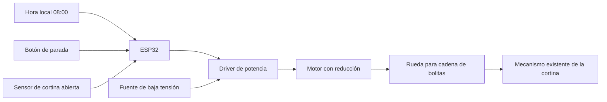

# Cortina automática

Proyecto DIY para abrir una cortina roller con cadena de bolitas **todos los días a las 08:00**. Horario local propuesto: Argentina (UTC−03:00), pendiente de confirmar.

## Estado

Primera versión: diseño y simulación en computadora. **Todavía no controla motores**. Las nuevas fotos confirman un paso a paso **28BYJ-48 de 5 V**, candidato para pruebas, además de un microservo y un motor DC. Falta medir la fuerza de la cadena y elegir placa, alimentación y sensores. El enchufe está lejos; comparamos cable de baja tensión y batería en la [guía de hardware](docs/hardware.md). No hay firmware listo para instalar ni cableado definitivo.

El usuario estima unos **3 metros al enchufe** y describe la cadena como **algo dura**. La batería es una alternativa aceptable para él. Priorizamos medir la fuerza: no se considera validado el 28BYJ-48 para levantar esta cortina.

Para avanzar sin dinamómetro, el usuario propuso dimensionar con **2 kgf de tracción supuesta**. La [selección preliminar de motor](docs/motor.md) propone un Pololu 37D de 12 V, 100:1, con rueda de diámetro efectivo cercano a 3 cm. Ese supuesto no es una medición ni una validación del montaje.

La caja fotografiada corresponde al Freenove RFID Starter Kit **FNK0025**. El usuario tiene el kit, pero ninguna placa programable. Proponemos una placa de desarrollo ESP32 con Wi-Fi; el modelo exacto se decidirá antes del cableado. No hace falta una Raspberry Pi para esta arquitectura.

## Cómo funcionaría



Una rueda adaptada a las bolitas mueve la cadena desde un soporte fijo. Conservamos el mecanismo superior. La transmisión necesita una forma de desacoplarla para poder usar la cortina a mano; no se debe forzar la cadena contra un motor trabado.

## Probar ahora

Python 3.10 o superior, sin paquetes adicionales. Desde la raíz del proyecto:

```console
python -m unittest discover -s tests -v
python -m cortina.simulate
python -m cortina.simulate --scenario timeout
python -m cortina.simulate --scenario stop
```

La simulación adelanta el reloj virtual: no espera hasta mañana ni mueve hardware. Demuestra apertura a las 08:00, parada por sensor, parada manual y tiempo máximo. Los tiempos de movimiento son ejemplos, no una calibración real.

El modelo registra el intento antes de iniciar el movimiento para evitar repetirlo al reiniciar. Un fallo o una parada no producen reintentos automáticos ese día. Sólo acepta la apertura dentro del minuto 08:00; si se pierde esa ventana, espera al día siguiente. Con hora no válida no inicia una apertura.

## Próximos pasos

1. Confirmar la inscripción del driver fuera de su bolsa; el 28BYJ-48 de 5 V ya está identificado.
2. Completar [las mediciones](docs/hardware.md), incluyendo fuerza, cadena y recorrido.
3. Elegir placa, motor, driver y fuente en función de esas mediciones.
4. Probar motor y sensores sobre la mesa, sin acoplar la cortina.
5. Construir rueda, soporte, liberación manual y sensor de apertura.
6. Implementar firmware, calibrar y verificar el conjunto con supervisión antes del uso diario.

Ver [arquitectura y criterios de prueba](docs/architecture.md). Las fotos personales y las credenciales Wi-Fi no se incluyen en Git.

## Fuentes

- [Freenove FNK0025: documentación oficial](https://docs.freenove.com/projects/fnk0025/en/latest/index.html).
- [Tutorial del kit: motor, servo y motor paso a paso](https://docs.freenove.com/projects/fnk0025/en/latest/fnk0025/python-tutorial.html).
- [ESP32: documentación de Espressif](https://documentation.espressif.com/esp32_datasheet_en.html).

Estas fuentes describen los productos; no confirman el inventario particular ni el torque disponible en esta cortina.
